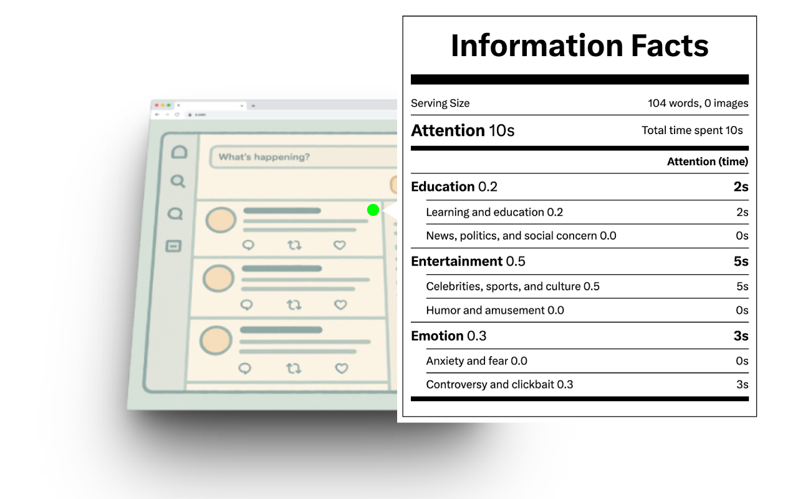
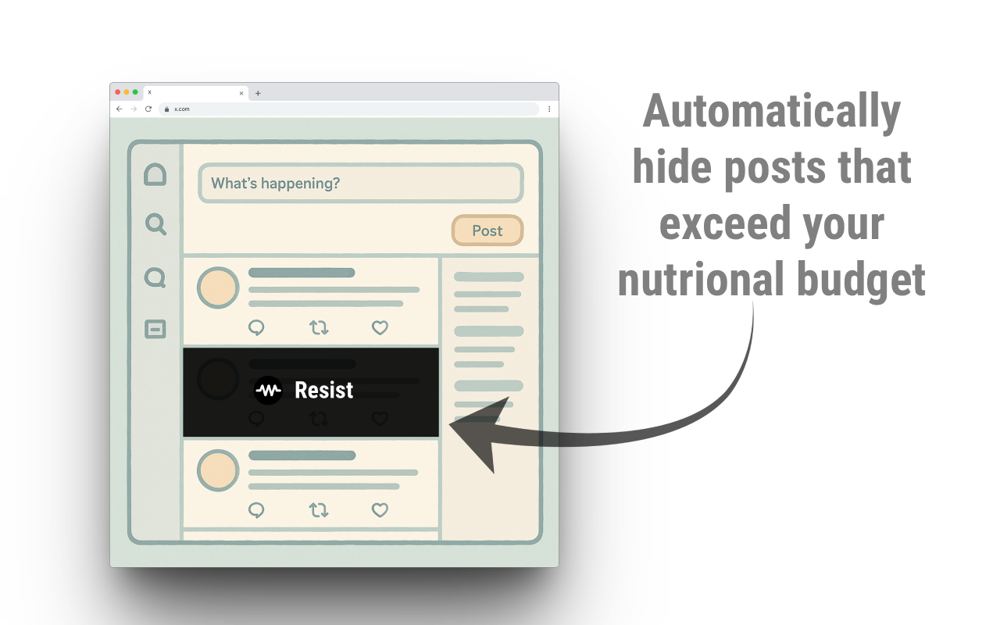
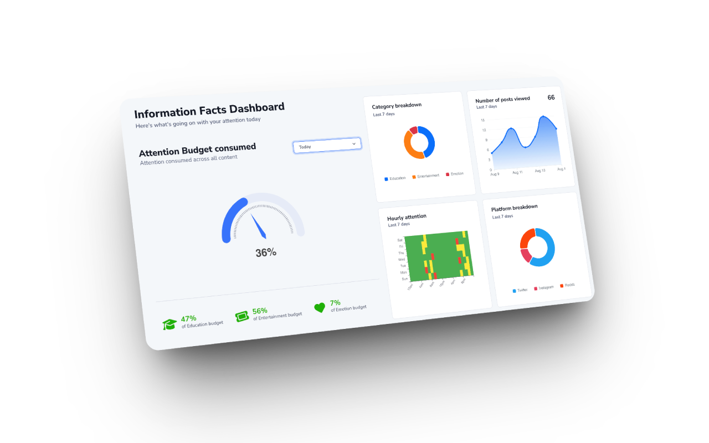

# Resist - Digital Nutrition Labels


**[⬇️ Install from Chrome Web Store](https://chromewebstore.google.com/detail/resist/paeflkahgaodaojpkhcijkaecnomomph)** | **[▶ Watch Demo](https://youtu.be/UmWCdgHQ_8o)**

A Chrome extension that creates nutrition labels for digital content, helping users make informed decisions about their digital consumption.



## Features

- **Content Classification**: Automatically categorizes posts as Education, Entertainment, or Emotional using AI analysis
- **Background Processing**: Operates passively with no user interaction required - no tagging, buttons, or interruptions
- **Attention Budgeting**: Set daily consumption limits per content category with automatic post filtering when budgets are exceeded
- **Analytics Dashboard**: Real-time consumption tracking, weekly trends, and budget monitoring with visual breakdowns
- **Local-First Privacy**: All data stored locally in browser storage - no credentials or personal data transmitted
- **Platform Support**: Twitter/X implementation with extensible architecture for additional platforms





## Installation

### Development Setup

1. Clone the repository:
   ```bash
   git clone <repository-url>
   cd resist
   ```

2. Install dependencies:
   ```bash
   npm install
   ```

3. Build the extension:
   ```bash
   npm run build
   ```

4. Load in Chrome:
   - Open Chrome and navigate to `chrome://extensions/`
   - Enable "Developer mode"
   - Click "Load unpacked" and select the `dist` folder

### Development Mode

For development with extensive logging/debugging:
```bash
npm run dev:build
```

## Usage

1. **Browse Social Media**: Visit Twitter/X as normal
2. **View Nutrition Labels**: The extension automatically analyzes posts and attaches displays nutrition labels to each tweet
3. **Access Dashboard**: Click the extension icon to view detailed analytics and settings
4. **Customize**: Use the settings page to adjust parameters and preferences


## Project Structure

```
src/
├── manifest.json           # Chrome extension manifest
├── content.ts             # Content script for social media sites
├── background-service-worker.ts  # Background service worker
├── popup.ts               # Extension popup interface
├── settings/              # Settings dashboard
├── platforms/             # Platform-specific implementations
└── utils/                 # Shared utilities
```

## Tech

- **TypeScript** - Type-safe JavaScript
- **Vite** - Build tool and bundler
- **Hugging Face Transformers** - AI/ML for local content analysis
- **Chrome Extensions API** - Browser integration

## Remote Classification API

The extension supports remote content analysis (using Grok) through a configurable API endpoint. _**Developers are requested to either disable remote classification or use their own servers during development.**_

To set up your own analysis server:

1. Configure the endpoint in **Settings > Advanced > Remote Analysis URL**
2. Default endpoint: `https://api.resist-extension.org/api/analyze`

### API Specification

**Endpoint**: `GET /api/analyze?content={urlencoded_json}`

**Request Query Parameter**:
```json
{
  "text": "AuthorName: Post content text (truncated to 1000 chars)",
  "media_elements": ["https://example.com/image1.jpg", "https://example.com/image2.png"]
}
```

**Response Format**:

**Success Response**:
```json
{
    "Education": {
        "subcategories": {
            "Learning and education": {"score": 0.25},
            "News, politics, and social concern": {"score": 0.05}
        },
        "totalScore": 0.3
    },
    "Emotion": {
        "subcategories": {
            "Anxiety and fear": {"score": 0.2},
            "Controversy and clickbait": {"score": 0.1}
        },
        "totalScore": 0.3
    },
    "Entertainment": {
        "subcategories": {
            "Celebrities, sports, and culture": {"score": 0.1},
            "Humor and amusement": {"score": 0.3}
        },
        "totalScore": 0.4
    },
    "totalAttentionScore": 1.0
}
```

**Processing Response** (for async analysis):
```json
{
  "status": "processing",
  "retry_after": 5
}
```

**Error Response**:
```json
{
  "status": "error",
  "message": "Analysis failed: reason"
}
```

## Local Classification Models

The extension uses Hugging Face models for local content analysis. You can customize which models to use by editing `src/background-service-worker.ts`:

### Text Classification Model
```typescript
static model = 'Xenova/mobilebert-uncased-mnli';
```

**Alternative models**:
- `Xenova/distilbert-base-uncased-mnli`
- `Xenova/bart-large-mnli`

### Image Captioning Model
```typescript
static model = 'Xenova/vit-gpt2-image-captioning';
```

**Alternative models**:
- `Salesforce/blip-image-captioning-base`
- `Xenova/vit-gpt2-image-captioning-large`

**Note**: After changing models, rebuild the extension with `npm run build`. First-time model loading may take longer as models are downloaded and cached locally.

## Adding Custom Analysis Tasks

The extension uses a task-based architecture for processing the content of every post. You can extend the functionality of the software easily by adding new analysis tasks (for eg., video analysis, sentiment analysis) in `src/task-manager.ts`:

### 1. Define Task Type
Add your task type to the task initialization in `initializeTasksForPost()`:
```typescript
const tasks: Task[] = [
  // ... existing tasks
  {
    id: `${postId}-your-task`,
    type: 'your-task',
    status: 'pending',
    resultType: 'text' // or 'classification'
  }
]
```

### 2. Add Task Handler
Add a case to the task execution switch statement:
```typescript
switch (task.type) {
  // ... existing cases
  case 'your-task':
    result = await this.executeYourTask(platform, post, postId)
    break
}
```

### 3. Implement Task Method
Create the execution method:
```typescript
private async executeYourTask(platform: SocialMediaPlatform, post: PostElement, postId: string): Promise<string> {
  // Your analysis logic here
}
```

**Available task types**: `mock-task` (for testing/debugging), `post-text`, `image-description`, `remote-analysis`

## License

MIT License - see [LICENSE](LICENSE) file for details